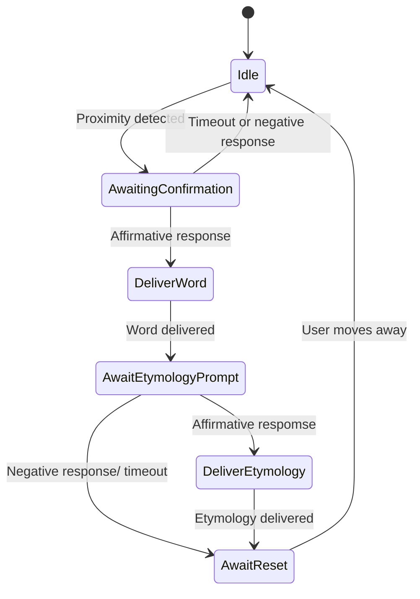

# W.E.S. - Interactive Word of the Day Assistant

## Overview
Etumos is an educational Raspberry Pi-powered voice assistant designed to teach users a new word daily, complete with spelling, definition, examples, and optional etymology. The system employs a proximity sensor to initiate interaction, leverages a local LLM via Ollama to fetch daily word data, and uses speech recognition and text-to-speech for natural voice conversations.

The design emphasizes managing user expectations around latency and delivering information in digestible segments to encourage user engagement and learning.

## Features
- Proximity sensor triggers interactions non-intrusively.
- Fetches a unique Word of the Day via Ollama LLM with structured data.
- Speech recognition for user responses with Google Speech API backend.
- Text-to-speech output with gTTS.
- Visual feedback and status display on Mini PiTFT (Adafruit ST7789).
- Robust state machine managing interactive dialogue flow.
- Error handling for speech recognition and LLM access interruptions.

## Hardware Setup
- Raspberry Pi (model with I2C and SPI support recommended)
- VCNL4040 Proximity Sensor connected over I2C
- Mini PiTFT ST7789 display connected over SPI with specified pins
- USB or Pi-compatible microphone for speech input
- USB speakers or audio output for voice playback

## Software Setup

### Prerequisites
- Raspberry Pi OS Lite (64-bit recommended)
- Enable I2C and SPI using `raspi-config`
- Configure microphone input device index
- Run and configure local Ollama LLM server

### Installation

Clone or download this repository and enter the directory.

Install the required Python packages:
pip install -r requirements.txt

### Running the W.E.S.

Run the main script: Approach the device to start interaction and follow spoken prompts.

## State Machine Diagram

## Future Improvements

- Physical reset buttons for manual control
- Additional sensors for ambient context awareness
- Pre-loading word data to mitigate latency
- Enhanced speech-to-text confirmation for uncertain user inputs
- Web-based wizarding controller

## Contributing

Contributions are welcome. Please open issues or pull requests for suggested features, bugfixes, or improvements.
